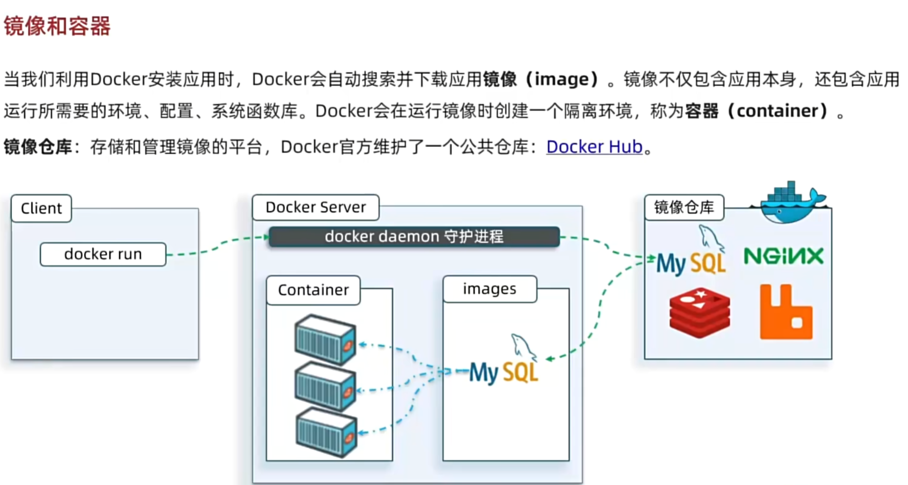
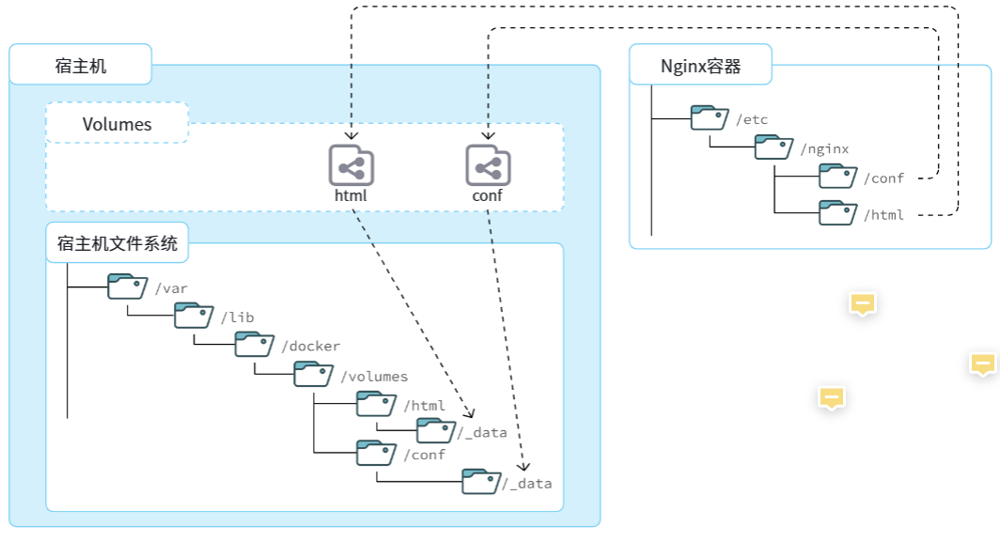
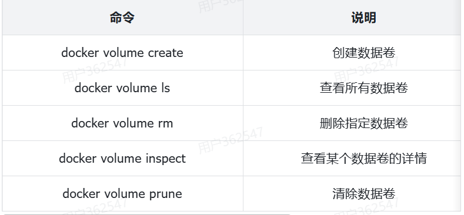

# Docker

## 目录

- [[#1、快速入门]]
  - [[#部署MySQL]]
- [[#2、常见命令]]
- [[#3、数据卷]]
  - [[#数据卷常用命令]]
  - [[#匿名卷]]
  - [[#挂载本地目录或文件]]

## 1、快速入门

### 部署MySQL

1. 部署

   ```powershell
   docker run -d \
     --name mysql \
     -p 3306:3306 \
     -e TZ=Asia/Shanghai \
     -e MYSQL_ROOT_PASSWORD=123 \
     mysql
   ```

   Docker 会自动搜索并下载 MySQL。注意：这里下载的不是安装包，而是镜像。镜像中不仅包含了 MySQL 本身，还包含了其运行所需要的环境、配置、系统级函数库。因此它在运行时就有自己独立的环境，就可以跨系统运行，也不需要手动再次配置环境了。这套独立运行的隔离环境我们称为**容器**。

   说明：
   - **镜像**：英文是 image
   - **容器**：英文是 container

   

2. 命令解读

   - `docker run`：创建并运行一个容器，`-d` 让容器在后台运行
   - `--name`：为容器起名
   - `-p 3306:3306`：设置端口映射。容器是一个独立的小空间，有独立的资源，需要设置主机到容器的映射：`-p 宿主机端口:容器端口`
   - `-e KEY=VALUE`：设置环境变量（不同镜像不一样）
   - `mysql`：指定运行的镜像的名字；镜像命名规范：`镜像名:版本号`

## 2、常见命令

1. `docker pull` - 拉取镜像
2. `docker images` - 查看本地镜像
3. `docker rmi` - 删除本地镜像
4. `docker save` - 保存镜像到本地压缩文件
5. `docker load` - 加载本地压缩文件到镜像
6. `docker run` - 创建并运行容器
7. `docker ps` - 查看正在运行的容器；`-a` 查看所有容器
8. `docker stop` - 停止容器
9. `docker start` - 启动容器
10. `docker rm` - 删除容器；`-f` 强制删除
11. `docker logs` - 查看日志；`-f` 持续输出日志
12. `docker exec -it 容器名 bash` - 进入容器，`-it` 添加可交互的终端

## 3、数据卷

**数据卷（volume）** 是一个虚拟目录，是容器内目录与宿主机目录之间映射的桥梁。

以 Nginx 为例，Nginx 中有两个关键的目录：
- `html`：放置一些静态资源
- `conf`：放置配置文件

如果我们要让 Nginx 代理我们的静态资源，最好是放到 `html` 目录；如果我们要修改 Nginx 的配置，最好是找到 `conf` 下的 `nginx.conf` 文件。

但遗憾的是，容器运行的 Nginx 所有的文件都在容器内部。所以我们必须利用数据卷将两个目录与宿主机目录关联，方便我们操作。如图：



在上图中：
- 我们创建了两个数据卷：`conf`、`html`
- Nginx 容器内部的 `conf` 目录和 `html` 目录分别与两个数据卷关联
- 而数据卷 `conf` 和 `html` 分别指向了宿主机的 `/var/lib/docker/volumes/conf/_data` 目录和 `/var/lib/docker/volumes/html/_data` 目录

这样一来，容器内的 `conf` 和 `html` 目录就与宿主机的 `conf` 和 `html` 目录关联起来，我们称为**挂载**。此时，我们操作宿主机的 `/var/lib/docker/volumes/html/_data` 就是在操作容器内的 `/usr/share/nginx/html/_data` 目录。只要我们将静态资源放入宿主机对应目录，就可以被 Nginx 代理了。

`/var/lib/docker/volumes` 这个目录就是默认的存放所有容器数据卷的目录，其下再根据数据卷名称创建新目录，格式为 `/数据卷名/_data`。

### 数据卷常用命令



注意：容器与数据卷的挂载要在创建容器时配置，对于创建好的容器，是不能设置数据卷的。而且**创建容器的过程中，数据卷会自动创建**。

示例：

```bash
# 1. 首先创建容器并指定数据卷，注意通过 -v 参数来指定数据卷
docker run -d --name nginx -p 80:80 -v html:/usr/share/nginx/html nginx

# 2. 然后查看数据卷
docker volume ls
# 结果
DRIVER    VOLUME NAME
local     29524ff09715d3688eae3f99803a2796558dbd00ca584a25a4bbc193ca82459f
local     html

# 3. 查看数据卷详情
docker volume inspect html
# 结果
[
    {
        "CreatedAt": "2024-05-17T19:57:08+08:00",
        "Driver": "local",
        "Labels": null,
        "Mountpoint": "/var/lib/docker/volumes/html/_data",
        "Name": "html",
        "Options": null,
        "Scope": "local"
    }
]

# 4. 查看 /var/lib/docker/volumes/html/_data 目录
ll /var/lib/docker/volumes/html/_data
# 可以看到与 nginx 的 html 目录内容一样，结果如下：
总用量 8
-rw-r--r--. 1 root root 497 12月 28 2021 50x.html
-rw-r--r--. 1 root root 615 12月 28 2021 index.html

# 5. 进入该目录，并随意修改 index.html 内容
cd /var/lib/docker/volumes/html/_data
vi index.html

# 6. 打开页面，查看效果

# 7. 进入容器内部，查看 /usr/share/nginx/html 目录内的文件是否变化
docker exec -it nginx bash
```

### 匿名卷

```powershell
# 1. 查看 MySQL 容器详细信息
docker inspect mysql
# 关注其中的 .Config.Volumes 部分和 .Mounts 部分
```

看结果中的 `.Mounts` 部分：

```json
{
  "Mounts": [
    {
      "Type": "volume",
      "Name": "29524ff09715d3688eae3f99803a2796558dbd00ca584a25a4bbc193ca82459f",
      "Source": "/var/lib/docker/volumes/29524ff09715d3688eae3f99803a2796558dbd00ca584a25a4bbc193ca82459f/_data",
      "Destination": "/var/lib/mysql",
      "Driver": "local"
    }
  ]
}
```

可以发现其中有几个关键属性：
- **Name**：数据卷名称。由于定义容器未设置容器名，这里的就是匿名卷自动生成的名字，一串 hash 值。
- **Source**：宿主机目录
- **Destination**：容器内的目录

上述配置是将容器内的 `/var/lib/mysql` 目录与数据卷 `29524ff09715d3688eae3f99803a2796558dbd00ca584a25a4bbc193ca82459f` 挂载。于是在宿主机中就有了 `/var/lib/docker/volumes/29524ff09715d3688eae3f99803a2796558dbd00ca584a25a4bbc193ca82459f/_data` 这个目录。这就是匿名数据卷对应的目录，其使用方式与普通数据卷没有差别。

### 挂载本地目录或文件

可以发现，数据卷的目录结构较深，如果我们去操作数据卷目录会不太方便。在很多情况下，我们会直接将容器目录与宿主机指定目录挂载。挂载语法与数据卷类似：

```bash
# 挂载本地目录
-v 本地目录:容器内目录
# 挂载本地文件
-v 本地文件:容器内文件
```

**注意**：本地目录或文件必须以 `/` 或 `./` 开头，如果直接以名字开头，会被识别为数据卷名而非本地目录名。

例如：

```bash
-v mysql:/var/lib/mysql       # 会被识别为一个数据卷叫 mysql，运行时会自动创建这个数据卷
-v ./mysql:/var/lib/mysql     # 会被识别为当前目录下的 mysql 目录，运行时如果不存在会创建目录
```
