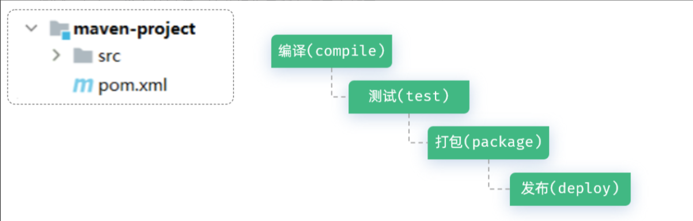

# Maven 介绍
**maven是一款用于管理和构建Java项目的工具**
1. 作用：
	1. 依赖管理：管理项目依赖的资源(jar包)，避免版本冲突问题。使用maven进行项目依赖(jar包)管理时，只需要在maven项目的pom.xml文件中，添加一段配置即可实现
		```
		<dependency>  
		    <groupId>org.springframework.boot</groupId>  
		    <artifactId>spring-boot-starter-webmvc</artifactId>  
		</dependency>
		```
	2. 项目构建：Maven提供了标准化的跨平台的自动化构建方式。 Maven提供了一套简单的命令来完成项目构建。
		
	3. 统一项目结构
	**maven-project01**

		|--- src (源代码目录和测试代码目录)
			|--- main (源代码目录)
				|--- java (源代码java文件目录)
				|--- resources (源代码配置文件目录)
			|--- test (测试代码目录)
				|--- java (测试代码java目录)
				|--- resources (测试代码配置文件目录)
		|--- target (编译、打包生成文件存放目录)
# Maven仓库

仓库：用于存储资源，管理各种jar包（**仓库的本质**就是一个目录(文件夹)，这个目录被用来存储开发中所有依赖(就是jar包)和插件）
Maven仓库分为：
- 本地仓库：自己计算机上的一个目录(用来存储jar包)
- 中央仓库：由Maven团队维护的全球唯一的。仓库地址：https://repo1.maven.org/maven2/
- 远程仓库(私服)：一般由公司团队搭建的私有仓库

当项目中使用坐标引入对应依赖jar包后，
- 首先会查找本地仓库中是否有对应的jar包
- 如果有，则在项目直接引用
- 如果没有，则去中央仓库中下载对应的jar包到本地仓库
- 如果还可以搭建远程仓库(私服)，将来jar包的查找顺序则变为： 本地仓库 --> 远程仓库--> 中央仓库
# Maven 的 pom文件
POM (Project Object Model) ：指的是项目对象模型，用来描述当前的maven项目
```XML
<?xml version="1.0" encoding="UTF-8"?>
<project xmlns="http://maven.apache.org/POM/4.0.0"
         xmlns:xsi="http://www.w3.org/2001/XMLSchema-instance"
         xsi:schemaLocation="http://maven.apache.org/POM/4.0.0 http://maven.apache.org/xsd/maven-4.0.0.xsd">
    <!-- POM模型版本 -->
    <modelVersion>4.0.0</modelVersion>

    <!-- 当前项目坐标 -->
    <groupId>com.itheima</groupId>
    <artifactId>maven-project01</artifactId>
    <version>1.0-SNAPSHOT</version>
    
    <!-- 项目的JDK版本及编码 -->
    <properties>
        <maven.compiler.source>17</maven.compiler.source>
        <maven.compiler.target>17</maven.compiler.target>
        <project.build.sourceEncoding>UTF-8</project.build.sourceEncoding>
    </properties>

</project>
```
**pom文件详解：**

- `<project>` ：pom文件的根标签，表示当前maven项目
- `<modelVersion>`：声明项目描述遵循哪一个POM模型版本
    - 虽然模型本身的版本很少改变，但它仍然是必不可少的。
- 坐标 ：
    - `<groupId>` `<artifactId>` `<version>`
    - 定位项目在本地仓库中的位置，由以上三个标签组成一个坐标
- `<maven.compiler.source>` ：编译JDK的版本
- `<maven.compiler.target>` ：运行JDK的版本
- `<project.build.sourceEncoding>` : 设置项目的字符集
#### Maven 坐标
Maven中的坐标是**资源****的唯一标识** , 通过该坐标可以唯一定位资源位置，使用坐标来定义项目或引入项目中需要的依赖
Maven坐标主要组成：
- groupId：定义当前Maven项目隶属组织名称（通常是域名反写，例如：com.itheima）
- artifactId：定义当前Maven项目名称（通常是模块名称，例如 order-service、goods-service）
- version：定义当前项目版本号
    - SNAPSHOT: 功能不稳定、尚处于开发中的版本，即快照版本
    - RELEASE: 功能趋于稳定、当前更新停止，可以用于发行的版本