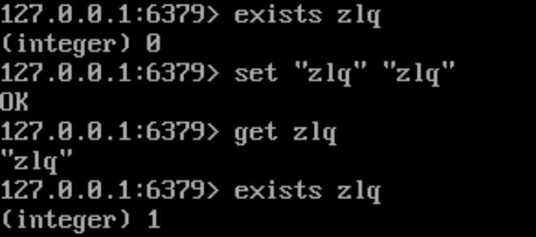
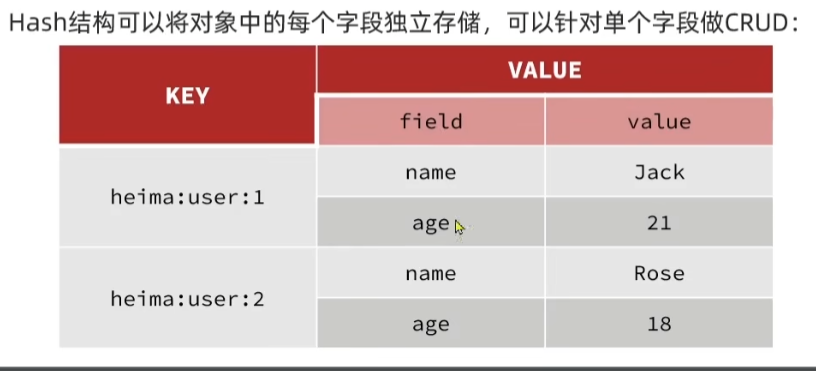
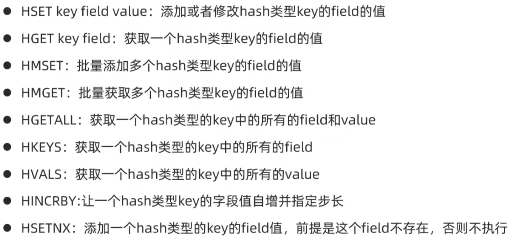
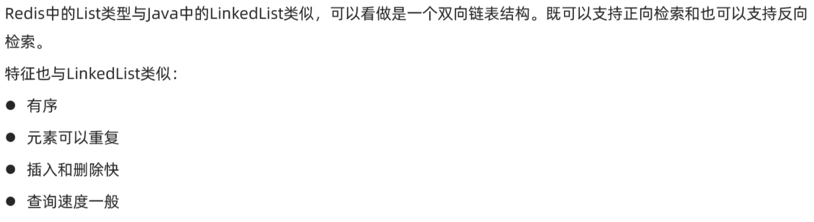
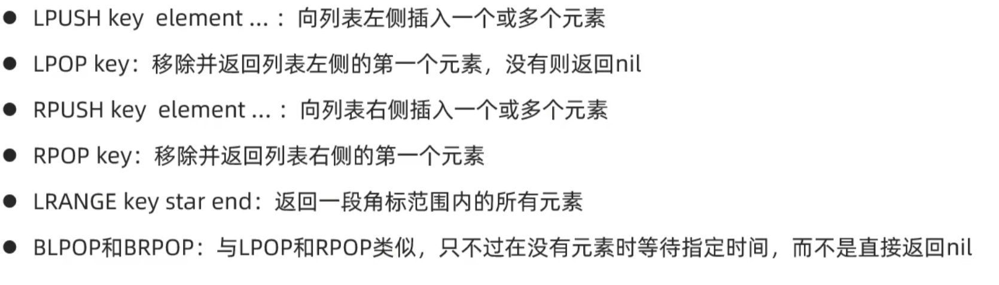
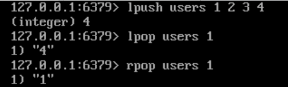
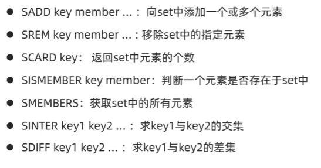

# Redis简介
Redis 本质上是一个由 Salvatore Sanfilippo 写的 key-value 存储系统，是跨平台的非关系型数据库。也是开源的使用 ANSI C 语言编写、遵守 BSD 协议、支持网络、可基于内存、分布式、可选持久性的键值对(Key-Value)存储数据库，并提供多种语言的 API。

Redis 通常被称为数据结构服务器，因为值（value）可以是字符串(String)、哈希(Hash)、列表(list)、集合(sets)和有序集合(sorted sets)等类型。

# Redis命令
## 启动Redis客户端
1. redis-cli
	启动redis客户端。在redis客户端中：输入 auth [password]验证，然后输入ping检测redis服务是否在正常运行
2. 远程 redis 服务上执行命令，同样我们使用的也是 **redis-cli** 命令
	```bash
	redis-cli -h host -p port -a password
	```
	连接到主机为 127.0.0.1，端口为 6379 ，密码为 mypass 的 redis 服务上
	```bash
	redis-cli -h 127.0.0.1 -p 6379 -a "mypass"
	redis 127.0.0.1:6379>
	redis 127.0.0.1:6379> PING
	PONG
	```
## Redis 键(key)
redis存储的是“key:value”形式的数据，通过键的相关命令来操作键
下面给出了与 Redis 键相关的基本命令：
1. DEL key  删除已存在的key
2. EXISTS key 判断一个key是否存在
3. EXPIRE key seconds 给key设置一个过期时间
4. PEXPIRE key milliseconds 设置key的过期时间亿以毫秒计
等等
key运行有多个单词形成层级结构，多个单词之间用":"隔开
例如：project:type:id
## Redis 字符串(String)
String是Redis中最基础、最简单的数据类型，其特点有
- 可以存：普通文本、数字、二进制图片 / 视频 / 序列化字符串；
- 数字格式字符串支持自增自减；
- 单 key 单 value，一对一存储；
-  过期时间、原子操作都支持。
相关的常用命令
1. SET key value
		设置键值
		可加：ex seconds设置过期时间
2. GET key获取键对应的值
3. GETSET key value 获取旧值，设置新值
4. MSET 批量操作
5. MGET 批量操作
6. SETNX key value 不存在时才设置
7. INCR key 数值+1
8. INCRBY key incrment 增加指定数值
9. DECR 数值-1
10. DECRBY 减少指定数值
11. ttl key 查看过期时间

## Redis Hash
Hash类型，也叫散列表，其value是一个无序字典，类似Java中的HashMap
简单理解：Hash里面存的又是一个键值对


Hash常见命令：
	
## Redis List



## Redis Set
Set类似Java中的HashSet，可以看作是一个value为null的HashMap。因为也是hash表，因此具备一下特性：
- 无序
- 元素不可重复
- 查找快
- 支持交、并等等功能

